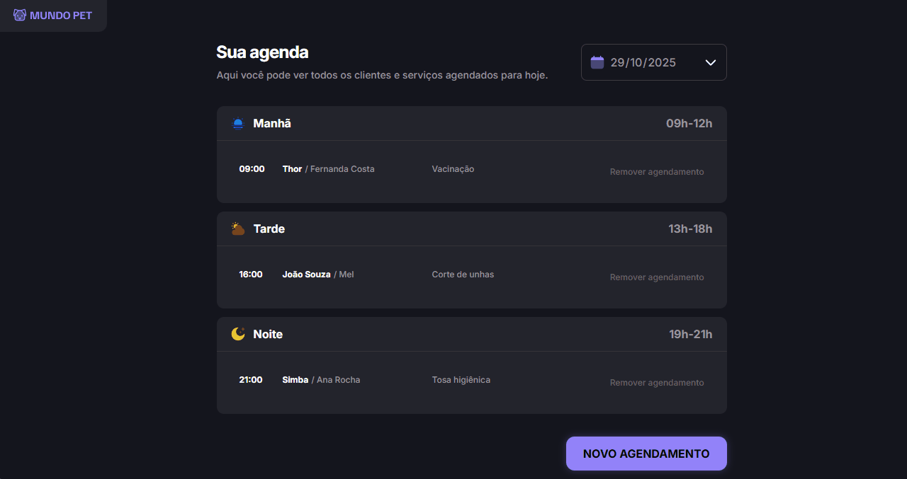

# 🐾 Mundo Pet - Sistema de Agendamentos

Sistema de gerenciamento de agendamentos para petshop, desenvolvido como projeto prático do curso de Formação Full-Stack da Rocketseat para finalizar o módulo de JavaScript Intermediário.

> 🎨 [Design original no Figma](https://www.figma.com/community/file/1448075887683449642/mundo-pet) criado pela Rocketseat

---

## 📑 Navegação

- [Preview](#-preview)
- [Funcionalidades](#-funcionalidades)
- [Diagrama](#-diagrama-de-funcionalidades)
- [Tecnologias](#️-tecnologias-utilizadas)
- [Estrutura](#-estrutura-do-projeto)
- [Como Executar](#-como-executar)
- [API](#-api-endpoints)
- [Aprendizados](#-aprendizados)
- [Contribuir](#-como-contribuir)
- [Contato](#-contato)

---

## 📸 Preview

### 🌐 [Acesse a aplicação online](https://seu-usuario.github.io/mundo-pet)

### 🎥 Demonstração



*Navegação pela aplicação, criação e remoção de agendamentos*

---

## ✨ Funcionalidades

- ✅ Visualização de agendamentos por data
- ✅ Criação de novos agendamentos
- ✅ Remoção de agendamentos existentes
- ✅ Filtro de agendamentos por data
- ✅ Validação automática de horários passados
- ✅ Prevenção de agendamentos duplicados
- ✅ Organização por períodos (Manhã, Tarde, Noite)
- ✅ Interface responsiva

---

## 🎯 Diagrama de Funcionalidades

```mermaid
flowchart TD
    A[Usuário] -->|Acessa| B[Mundo Pet]
    
    B -->|Visualiza| C[Lista de Agendamentos]
    C -->|Filtra por| D[Data Selecionada]
    
    B -->|Clica em| E[Novo Agendamento]
    E -->|Abre| F[Modal de Formulário]
    
    F -->|Valida| G{Horário Válido?}
    G -->|Não - Passado| H[Desabilita Option]
    G -->|Não - Duplicado| H
    G -->|Sim| I[Habilita Option]
    
    F -->|Preenche| J[Dados do Cliente]
    J -->|Envia| K[POST /appointments]
    
    K -->|Sucesso| L[Atualiza Lista]
    L -->|Renderiza| M[Cards por Período]
    
    M -->|Manhã 9h-12h| N1[Appointments Morning]
    M -->|Tarde 13h-18h| N2[Appointments Afternoon]
    M -->|Noite 19h-21h| N3[Appointments Night]
    
    M -->|Clica Remover| O[DELETE /appointments/:id]
    O -->|Remove do DOM| L
    
    D -->|Muda Data| P[GET /appointments?date=X]
    P -->|Retorna| L
    
    K -.->|Armazena| Q[(JSON Server)]
    P -.->|Busca| Q
    O -.->|Remove de| Q
    
    style B fill:#9282FA
    style Q fill:#2D2D2D
    style K fill:#4CAF50
    style O fill:#F44336
    style P fill:#2196F3
```


---

## 🛠️ Tecnologias Utilizadas

### Core
- **HTML5** - Estrutura semântica
- **CSS3** - Estilização e responsividade
- **JavaScript (ES6+)** - Lógica da aplicação

### Build & Dev Tools
- **Webpack** - Module bundler
- **Babel** - Transpilador JavaScript

### Bibliotecas
- **Day.js** - Manipulação de datas
- **JSON Server** - Mock API REST

---

## 📁 Estrutura do Projeto
```
mundo-pet/
├── public/
│   ├── index.html
│   └── assets/
├── src/
│   ├── main.js
│   ├── styles/
│   ├── components/
│   │   ├── modal-form.js
│   │   └── schedule.js
│   ├── services/
│   │   ├── api.config.js
│   │   └── api.js
│   ├── utils/
│   │   ├── date-utils.js
│   │   └── validators.js
│   └── libs/
│       ├── dayjs.js
│       └── time.js
├── db.json
├── webpack.config.js
└── package.json
```

---

## 🚀 Como Executar

### 🌐 Acesso Online

A forma mais rápida de testar a aplicação:

**[👉 Acessar Mundo Pet Online](https://seu-usuario.github.io/mundo-pet)**

> ⚠️ **Nota**: A versão online usa dados mockados localmente. Para testar todas as funcionalidades com persistência de dados, execute o projeto localmente.

---

### 💻 Execução Local

#### Pré-requisitos
- Node.js (v14 ou superior)
- npm ou yarn

#### Instalação

1. Clone o repositório
```bash
git clone https://github.com/seu-usuario/mundo-pet.git
cd mundo-pet
```

2. Instale as dependências
```bash
npm install
```

3. Inicie o JSON Server (API mock)
```bash
npm run server
```

4. Em outro terminal, inicie o servidor de desenvolvimento
```bash
npm run dev
```

5. Acesse no navegador
```
http://localhost:8080
```

#### Build para Produção
```bash
npm run build
```

Os arquivos otimizados estarão na pasta `dist/`.

---

## 🔌 API Endpoints

### Base URL
```
http://localhost:3333
```

### Rotas

| Método | Rota | Descrição | Body |
|--------|------|-----------|------|
| GET | `/appointments` | Lista todos os agendamentos | - |
| GET | `/appointments?date=YYYY-MM-DD` | Filtra por data | - |
| POST | `/appointments` | Cria novo agendamento | `{ tutor, pet, phone, service, date, time }` |
| DELETE | `/appointments/:id` | Remove agendamento | - |

---

## 📝 Funcionalidades Detalhadas

### Validação de Horários

O sistema implementa duas camadas de validação:

1. **Horários Passados**: Desabilita automaticamente horários que já passaram no dia atual
2. **Horários Duplicados**: Desabilita horários que já possuem agendamentos

Ambas as validações são dinâmicas e atualizam quando:
- O modal é aberto
- O usuário muda a data no formulário

### Organização por Períodos

Os agendamentos são automaticamente organizados em:
- **Manhã**: 9h às 12h
- **Tarde**: 13h às 18h
- **Noite**: 19h às 21h

---

## 🧪 Testes Realizados

- ✅ Criação de agendamentos
- ✅ Remoção de agendamentos
- ✅ Filtro por data
- ✅ Validação de horários passados
- ✅ Validação de horários duplicados
- ✅ Responsividade (mobile, tablet, desktop)
- ✅ Tratamento de erros de rede

---

## 🎓 Aprendizados

Este projeto consolidou conhecimentos em:
- Manipulação avançada do DOM
- Requisições HTTP com Fetch API
- Async/Await e Promises
- Modularização de código (ES6 Modules)
- Validações client-side
- Event delegation
- Manipulação de datas com bibliotecas
- Build tools (Webpack e Babel)

---

## 🤝 Como Contribuir

Contribuições são sempre bem-vindas! Se você tem alguma sugestão para melhorar este projeto:

1. Faça um Fork do projeto
2. Crie uma Branch para sua feature (`git checkout -b feature/AmazingFeature`)
3. Commit suas mudanças (`git commit -m 'Add some AmazingFeature'`)
4. Push para a Branch (`git push origin feature/AmazingFeature`)
5. Abra um Pull Request

### 💡 Ideias para Contribuir

- Adicionar testes automatizados
- Implementar edição de agendamentos
- Adicionar notificações push
- Melhorar acessibilidade (ARIA labels)
- Criar tema claro/escuro
- Adicionar internacionalização (i18n)

---

## 📄 Licença

Este projeto foi desenvolvido como parte do curso da Rocketseat e é de uso educacional.

---

## 👩‍💻 Contato

**Marcelle**

Desenvolvedora Full-Stack em transição de carreira | Background em tradução técnica e ensino de inglês

[](https://www.linkedin.com/in/seu-perfil)
[](https://github.com/seu-usuario)
[](mailto:seu-email@exemplo.com)

---

## 🎨 Créditos

- **Design**: [Rocketseat](https://www.rocketseat.com.br) - [Figma Community](https://www.figma.com/community/file/1448075887683449642/mundo-pet)
- **Formação**: [Rocketseat - Full-Stack](https://www.rocketseat.com.br)

---

<div align="center">

⭐ Desenvolvido com dedicação durante a Formação Full-Stack da Rocketseat

**Se este projeto te ajudou, deixe uma ⭐!**

</div>